# School District Data Analysis

## Project Overview
Prepare analysis of standardized test date to provide insight into performance trends and patterns within a school district. At the school and district level, the results will be used for discussions and strategic decisions. The analysis will further assist the school board and superintendant in making decisions regarding school budgets and priorities.

## School District Analysis requirements:
1. Snapshot of the school district's key metrics
2. Overview of the key metrics for each school
3. Top 5 Schools based on passing rate
4. Bottom 5 Schools based on passing rate
5. Average Math scores by student in each grade level by School
6. Average Reading scores by student in each grade level by School
7. School Performance based on Budget per student
8. School performance based on school size
9. School performance based on the type of school

Additionally, we are asked to prepare the same statistics above with marks for Grade 9 students at **Thomas High School** removed due to a problem with academic honesty. We will then run the analysis again and compare the results.

## Modified School District Analysis requirements:
1. Replace ninth grade reading and math scores for Thomas High School
2. Snapshot of the school district's key metrics
3. Overview of the key metrics for each school
4. Top 5 Schools based on passing rate
5. Bottom 5 Schools based on passing rate
6. Average Math scores by student in each grade level by School
7. Average Reading scores by student in each grade level by School
8. School Performance based on Budget per student
9. School performance based on school size
10. School performance based on the type of school

## Resources
- Data Source: schools_complete.csv, students_complete.csv
- Software: Python 3.7.10, Visual Studio Code 1.56.2, Jupyter Notebook Server 6.3.0

## Summary Results

## Baseline Analaysis of all Schools in the District

**School District Metrics**
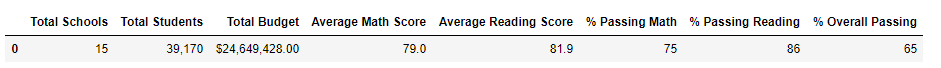

**School Summary Metrics**
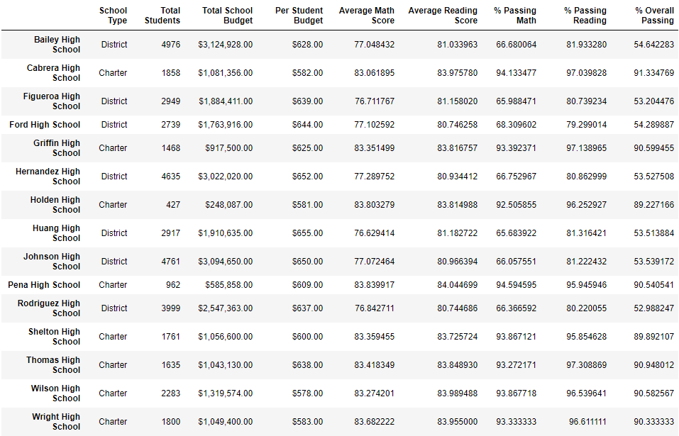

**Top 5 Performing Schools**
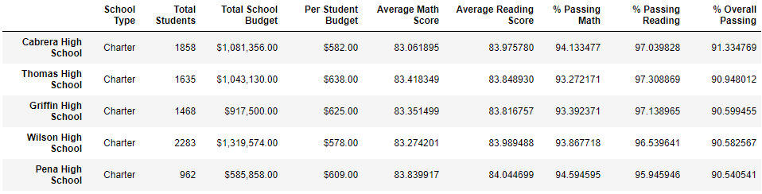

**Bottom 5 Performing Schools**
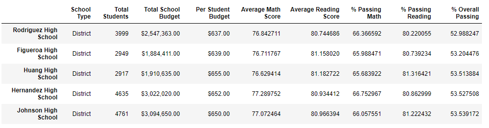

**Average Math score for each grade by School**
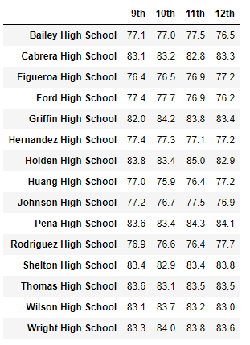

**Average Reading score for each grade by School**
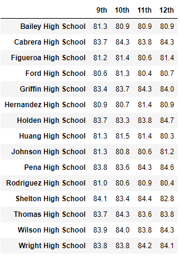

**Scores by School Spending per Student**
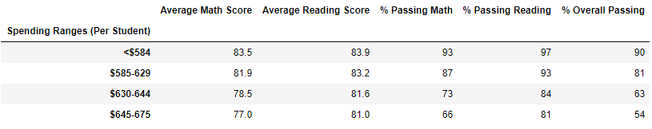

**Scores by School Size**
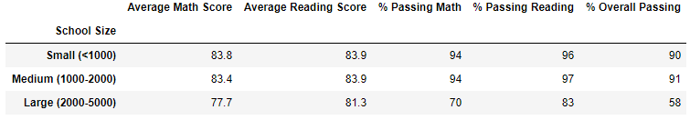

**Scores by School Type**
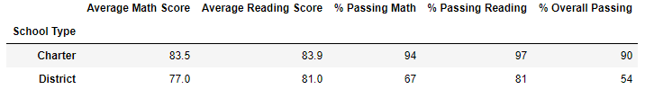

## Modified Analaysis with the removal of Thomas High School grade 9 student marks

**Thomas High School Student marks removed**
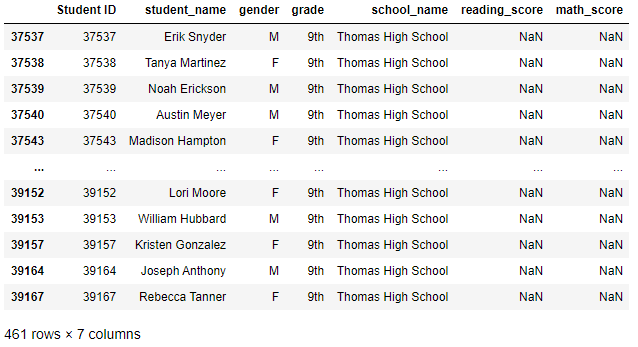

**School District Metrics**
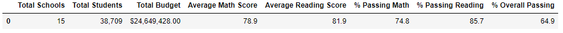

**School Summary Metrics**
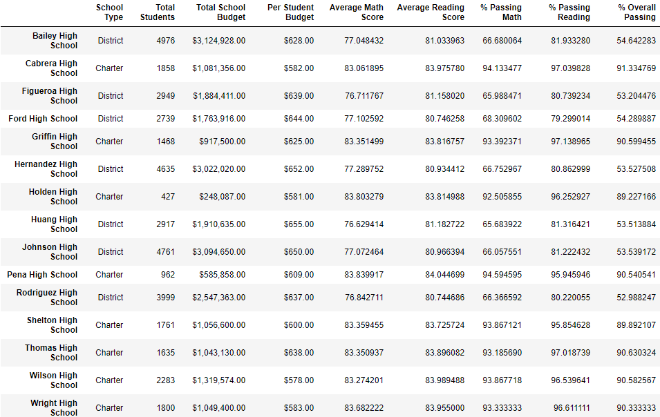

**Top 5 Performing Schools**
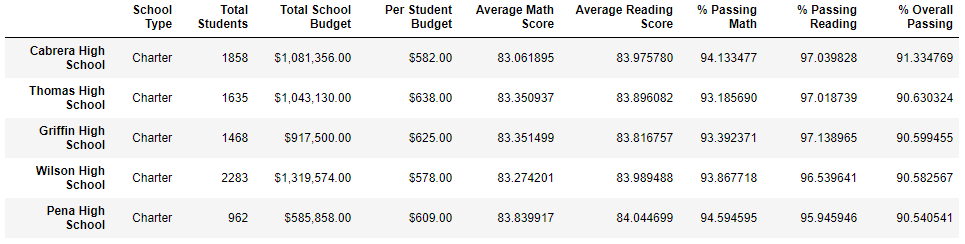

**Bottom 5 Performing Schools**
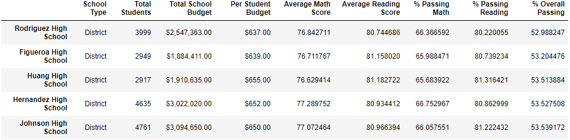

**Average Math score for each grade by School**
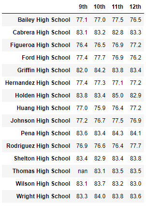

**Average Reading score for each grade by School**
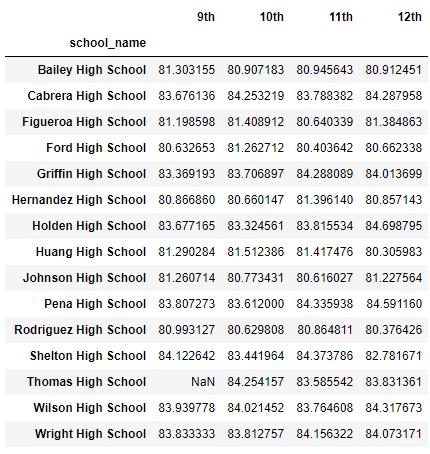

**Scores by School Spending per Student**
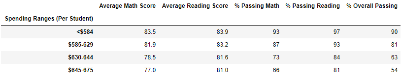

**Scores by School Size**
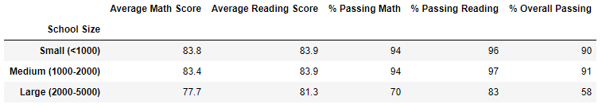

**Scores by School Type**
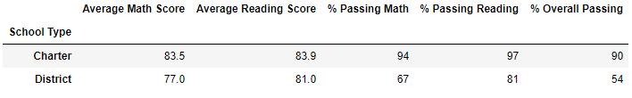

## District Analysis Results

- There is a bulleted list that addresses how each of the seven school district metrics was affected by the changes in the data

## District Analysis Summary

- There is a statement summarizing four changes to the school district analysis after reading and math scores have been replaced
