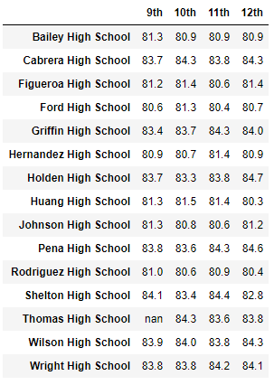

# School District Data Analysis

## Project Overview
Prepare analysis of standardized test data to provide insight into performance trends and patterns within a school district. At the school and district level, the results will be used for discussions and strategic decisions. The analysis will further assist the school board and superintendant in making decisions regarding school budgets and priorities. It has also come to the attention of the school board that math and reading grades may have been altered in the source file for grade nine students at Thomas High School. As such, we have been asked to perform the school district analysis as originally planned and also a second analysis with math and reading grades for grade nine removed for that specific school. A comparative report will be provided to determine the affect on the overall analysis.  

## School District Analysis requirements:
1. Snapshot of the school district's key metrics
2. Overview of the key metrics for each school
3. Top 5 Schools based on passing rate
4. Bottom 5 Schools based on passing rate
5. Average Math scores by student in each grade level by School
6. Average Reading scores by student in each grade level by School
7. School Performance based on Budget per student
8. School performance based on school size
9. School performance based on the type of school

## Modified School District Analysis with 9th grade marks removed, requirements:
1. Replace ninth grade reading and math scores for Thomas High School
2. Snapshot of the school district's key metrics
3. Overview of the key metrics for each school
4. Top 5 Schools based on passing rate
5. Bottom 5 Schools based on passing rate
6. Average Math scores by student in each grade level by School
7. Average Reading scores by student in each grade level by School
8. School Performance based on Budget per student
9. School performance based on school size
10. School performance based on the type of school

## Resources
- Data Source: schools_complete.csv, students_complete.csv
- Software: Python 3.7.10, Visual Studio Code 1.56.2, Jupyter Notebook Server 6.3.0

## Summary Results

### Baseline Analysis of all Schools in the District

- School District Summary

- Summary by School

- Top 5 Performing Schools

- Bottom 5 Performing Schools

- Average Math score for each grade by School

- Average Reading score for each grade by School

- Scores by School Spending per Student

- Scores by School Size

- Scores by School Type

### Modified Analysis with the removal of Thomas High School grade 9 student marks

- Thomas High School Grade 9 Student marks removed

- School District Summary

- Summary by School

- Top 5 Performing Schools

- Bottom 5 Performing Schools

- Average Math score for each grade by School

- Average Reading score for each grade by School

- Scores by School Spending per Student

- Scores by School Size

- Scores by School Type

## District Analysis Results

- The removal of the ninth grade reading and math grades at Thomas High School resulted in  the following observations:
    - School District Summary
    - Summary by School
    - In general, it appears that removing the grades had minimal impact on the results. The 461 students that had their grades removed represented 1.2% of all students in our data set.
    - The following results were observed after reviewing the comparative output reports shown above:
      - The math and reading scores by grade were ...
      - Scores by school spending were ...
      - Scores by school size ...
      - Scores by school type ...

## District Analysis Summary

- Four disctinct changes observed by the removing the ninth grade scores included:
  - Math and Reading scores went up
  - Scores by School size were unchanged
  - item 3 was observed
  - item 4 was observed
