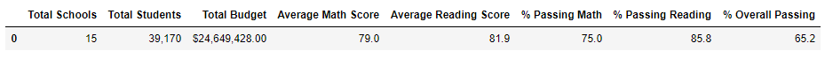
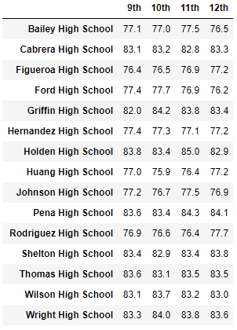
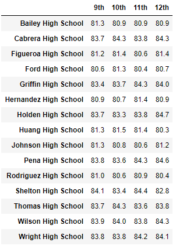

# School District Data Analysis

## Project Overview
Prepare analysis of standardized test data for a school board to be used for providing insight into performance trends and patterns within a school district. At the school and district level, the results will be used for discussions and strategic decisions. The analysis will further assist the school board and superintendant in making decisions regarding school budgets and priorities. 

It has also come to the attention of the school board that math and reading grades may have been altered in the source file for grade nine students at Thomas High School(THS). As such, we have been asked to perform the school district analysis as originally planned and also a second analysis with math and reading grades for grade nine removed for that specific school. A comparative analysis will be provided to determine the affect on the overall metrics of the school and district reports.  

## School District Analysis requirements:
1. Snapshot of the school district's key metrics
2. Overview of the key summary metrics for each school
3. Top 5 Schools based on passing rate
4. Bottom 5 Schools based on passing rate
5. Average Math scores by student in each grade level by School
6. Average Reading scores by student in each grade level by School
7. School Performance based on Budget per student
8. School performance based on school size
9. School performance based on the type of school

## Modified School District Analysis with 9th grade marks removed for THA, requirements:
1. Replace ninth grade reading and math scores for THS students
2. Snapshot of the school district's key metrics
3. Overview of the key summary metrics for each school
4. Top 5 Schools based on passing rate
5. Bottom 5 Schools based on passing rate
6. Average Math scores by student in each grade level by School
7. Average Reading scores by student in each grade level by School
8. School Performance based on Budget per student
9. School performance based on school size
10. School performance based on the type of school

## Resources
- Data Source: schools_complete.csv, students_complete.csv
- Software: Python 3.7.10, Visual Studio Code 1.56.2, Jupyter Notebook Server 6.3.0

## Summary Results

### Analysis of all Schools in the District

- School District Summary

- School Summary

- Top 5 Performing Schools

- Bottom 5 Performing Schools

- Average Math score for each grade by School

- Average Reading score for each grade by School

- Scores by School Spending per Student

- Scores by School Size

- Scores by School Type

### Modified Analysis of District with the removal of THS grade 9 student marks

- List of THS Grade 9 students whose marks were removed

- School District Summary

- School Summary

- Top 5 Performing Schools

- Bottom 5 Performing Schools

- Average Math score for each grade by School

- Average Reading score for each grade by School

- Scores by School Spending per Student

- Scores by School Size

- Scores by School Type

## District Analysis Results

- The removal of the ninth grade reading and math grades at THS resulted in the following observations:
    - For the School District Summary, the overall passing percentage moved down by 0.3%
    - For the School Summary, the overall passing percentage moved down by 0.3% for THS
    - THS was in the #2 ranked position of top ranked schools in the original analysis and maintained that same position in the modified analysis. The overall ranking was reduced by 0.3% comparatively.
    - The following results were observed after reviewing the scoring reports:
      - The math and reading scores by grade showed no observable changes
      - Scores by school spending showed no observable changes
      - Scores by school size showed no observable changes
      - Scores by school type showed no observable changes

## District Analysis Summary

- In general, the 461 grade nine students from THS whose marks were removed from the data set represented 1.2% of all students in the district. This small group of students affected the analysis at the school and district level and produced results that indicated the overall performance of THS was reduced by 0.3%. When we reviewed the scoring reports, no changes were observed. 
- The following conclusions can be drawn from the analysis with THS grade nine students removed:
  - For the entire district summary the overall passing percentage decreased by 0.3%
  - At the school level the overall passing percentage decreased by 0.3%
  - As the #2 top ranked school, the performance of THS overall passing percentage was reduced by 0.3%
  - Scores by school spending, grade, size and type remained exactly the same
 
